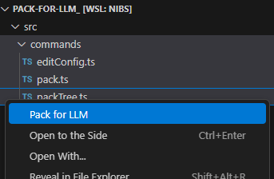
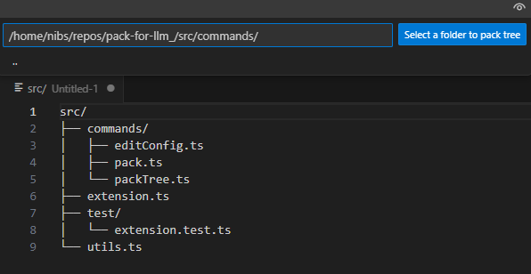

# pack-for-llm (Pack for LLM) README

Pack files and folders into a single, copy-pasteable document for large-language models (LLMs).

---

## Features

- **Pack Selected Files/Folders**  
  Right-click files or folder (or use the Command Palette) to run **Pack for LLM**, concatenating the files into one document with a customizable delimiter.  

  
- **Pack Directory Tree (Tree View)**  
  Generate a collapsible, "tree"-style listing of a folder’s structure for LLM context without listing every file path in full.  
  ` 
- **Customizable**  
  Define a custom file delimiter, exclude specific extensions or hidden files, or toggle whether to honor your workspace’s `.gitignore` definitions.

---

## Usage

1. **Select files or folders**  
   In the Explorer, right-click on one or more files or folders you want to pack.

2. **Run the command**  
   Choose **Pack for LLM** from the context menu, or open the Command Palette (`Ctrl+Shift+P` / `Cmd+Shift+P`) and search for `Pack for LLM`.

3. **Copy/save**  
   Copy the result or save the document for your LLM workflow.

4. **Pack Tree (Bonus)**  
Use the **Pack for LLM: Pack tree** command to inform the LLM about your directory structure.

---

## Extension Settings

This extension contributes the following settings (accessible via `Ctrl+Shift+P` → “Preferences: Open Settings (UI)” and searching for **packForLLM**):

- **packForLLM.delimiter**  
  _Type_: `string`  
  _Default_: `<<< FILE: ${file} >>>`  
  Template for the delimiter inserted before each file.

- **packForLLM.endDelimiter**  
  _Type_: `string`  
  _Default_: `<<< EOF >>>`  
  Template for the delimiter inserted after each file’s content.

- **packForLLM.useGitignore**  
  _Type_: `boolean`  
  _Default_: `true`  
  Whether to respect the workspace’s `.gitignore`.

- **packForLLM.ignoreExtensions**  
  _Type_: `string`  
  _Default_: `""`  
  Comma-separated list of file extensions to ignore.

- **packForLLM.ignoreHidden**  
  _Type_: `boolean`  
   _Default_: `true`  
  Whether to skip files and folders whose name begins with a dot (e.g. `.env`, `.vscode/`).

---

## Requirements

vscode: ^1.100.0

---

## Known Issues

- Large workspaces or deeply nested structures may take time to process.